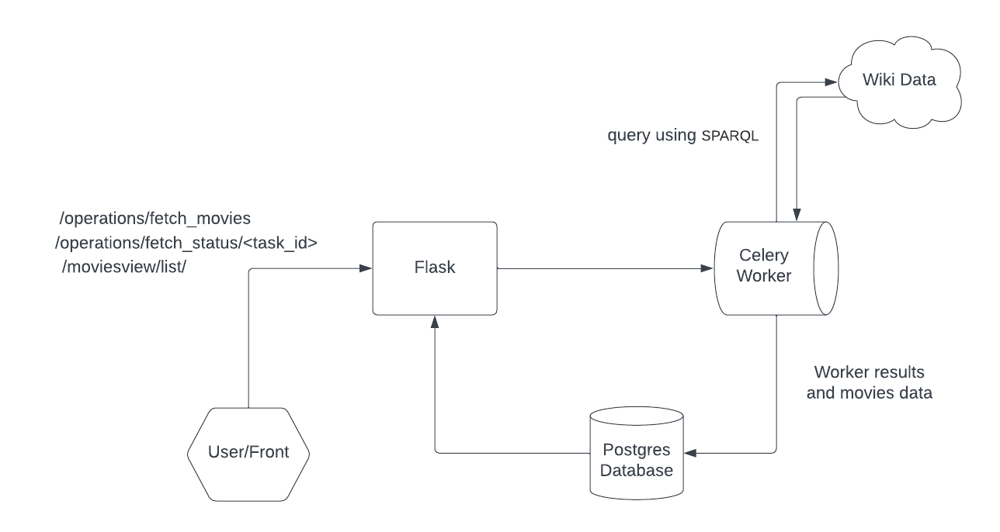

# FLASK_APPBUILDER

This demonstrate how to create quickly views using Flask AppBuilder  
we spins up celery tasks that runs in the background and query wiki data for movies records,  
the following diagram demonstrate the flow:  

